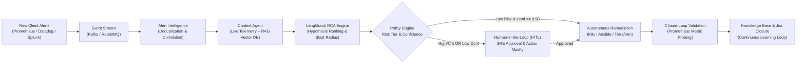
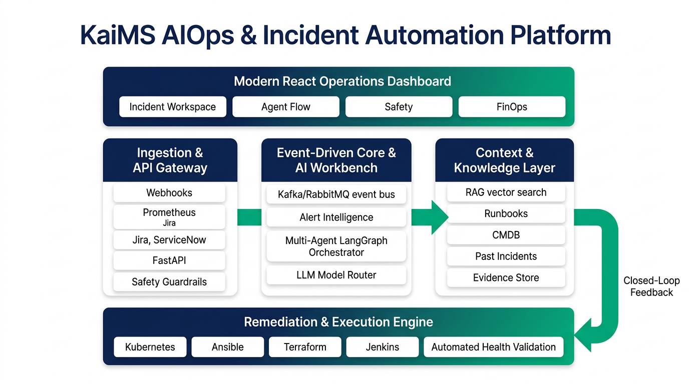
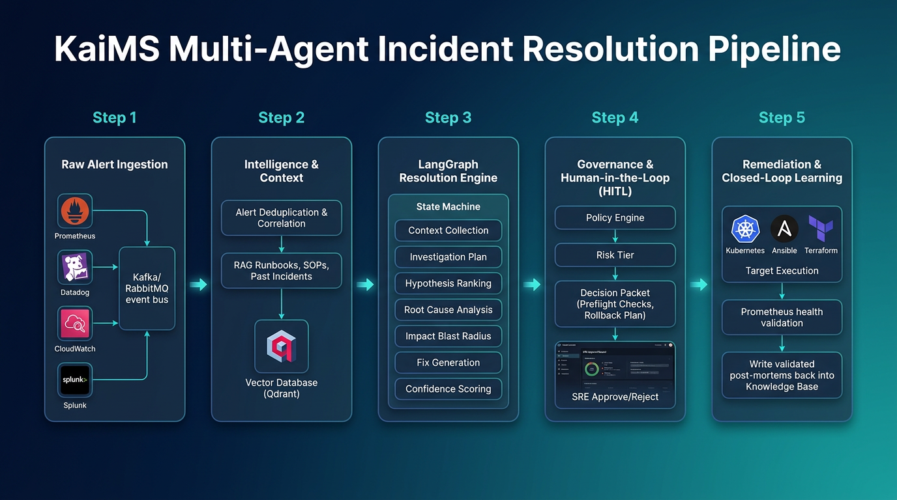
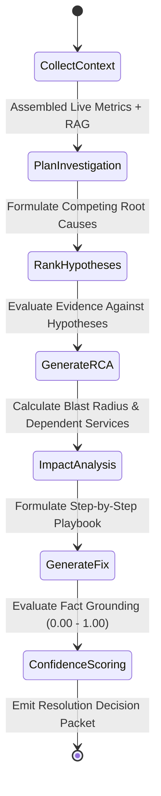
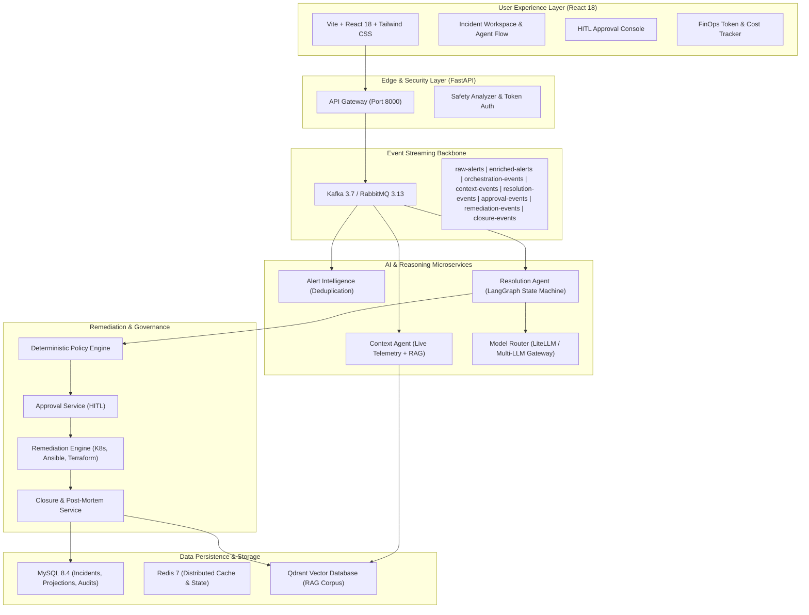

# KaiMS: Agentic Incident Resolution Platform
## Comprehensive Demo & Architecture Briefing

---

## 1. Executive Summary & Value Proposition

### 1.1 What KaiMS Is
**KaiMS** (Kaar AIOps Incident Management System) is an enterprise-grade, **agentic multi-agent incident triage, root-cause analysis (RCA), and remediation platform**. It transforms raw, chaotic operational alerts from heterogeneous client environments into validated, governed, and automated incident resolutions.

Instead of human Site Reliability Engineers (SREs) and L1/L2 operators manually sifting through hundreds of repetitive alerts, consulting static runbooks, cross-referencing dashboards, and manually executing shell commands, KaiMS acts as an **autonomous operational digital twin**. It ingests alerts in real-time, filters noise, reconstructs context from live systems and historical knowledge (RAG), runs multi-hypothesis causal reasoning, and proposes or executes safe remediation actions under strict **Human-in-the-Loop (HITL)** policy governance.

### 1.2 The Business Problem Solved
| Challenge Faced by Enterprises | How KaiMS Solves It | Quantifiable Business Impact |
| :--- | :--- | :--- |
| **Alert Fatigue & Noise** | 80–90% of raw alerts are duplicate, transient, or non-actionable symptoms of a single underlying event. | **Deduplication & Event Correlation** collapses alert storms into a single unified incident seed. |
| **High Mean Time to Detect/Resolve (MTTD/MTTR)** | Human triage takes 15–45 minutes just to collect logs, check recent commits, and identify the failing container/DB. | **Context Intelligence Agent** collects live metrics, CMDB topology, git commits, and past incidents in seconds. |
| **Tribal Knowledge & Stale Runbooks** | Runbooks exist as obsolete Confluence pages or inside senior engineers' heads. | **RAG Knowledge Base (Vector Search)** surfaces exact matching runbooks, past post-mortems, and proven remediation scripts. |
| **Risk of Runaway Automation** | Traditional scripts blindly restart services without evaluating blast radius or recent changes. | **Deterministic Policy Engine + HITL** enforces mandatory human sign-off for critical production actions. |
| **Cost & Model Inefficiency** | Large Language Models (LLMs) can be slow and expensive when unmonitored. | **Model Router & FinOps Tracking** dynamically routes tasks to optimal models (GPT-4o, Claude, local Llama) with cost attribution. |

---

## 2. System Architecture & Visual Overview

Below is the high-level architecture diagram showing how KaiMS bridges client ingestion, microservice orchestration, multi-agent AI reasoning, and target execution infrastructure:

### Architectural Paradigm: Separation of Concerns
1. **Cloud-Neutral / Cloud-Agnostic Core**: Can run on-premise, in sovereign cloud, on Azure, GCP, or AWS using standard Docker Compose or Kubernetes (EKS/AKS/GKE).
2. **Event-First Asynchronous Backbone**: Decoupled microservices communicating over Apache Kafka and RabbitMQ with dynamic stream routing.
3. **Pluggable AI Layer**: Zero hardcoded model dependencies; model router switches between OpenAI (GPT-4o/GPT-5), Anthropic Claude, Google Gemini, and local self-hosted LLMs (Ollama/vLLM with Qwen 2.5/Llama 3).
4. **Deterministic Guardrails Over Non-Deterministic AI**: The AI reasons and recommends, but deterministic policy engines and action catalogs dictate whether execution is allowed.

---

## 3. End-to-End Operational Pipeline: Step-by-Step

The following 5-stage pipeline illustrates how an incident flows from an initial telemetry trigger to autonomous closure:

### Stage 1: Raw Alert Ingestion & Safety Screening
* **Heterogeneous Intake**: Ingests alerts from client monitoring stacks via HTTP webhooks, Alertmanager endpoints, email inboxes (IMAP), and OpenSearch log pollers.
* **API Gateway & Safety Analyzer**: Every inbound payload passes through a safety gateway that checks for prompt injections, malicious payloads, credential leakage, and destructive commands (`rm -rf`, format drives, unauthorized shell scripts).
* **Landing Pad**: Persists raw alert envelopes to disk and database with immutable SHA256 fingerprints before publishing to the `raw-alerts` message bus topic.

### Stage 2: Alert Intelligence & Context Enrichment
* **Deduplication Engine**: Uses sliding time windows (e.g., 5-minute recurrence windows) and fingerprint hashing (`service:cluster:alertname:entity`) to suppress duplicate signals.
* **Incident Correlation**: Correlates multi-tier alerts (e.g., frontend HTTP 504 gateway timeout + backend payment API latency + DB thread pool exhaustion) into one parent incident.
* **Live Context Collection**: Context Intelligence Agent queries:
  * **Prometheus**: Metric time-series over a dynamic lookback window around alert trigger time.
  * **Kubernetes API**: Pod restart counts, crash loop backoffs, resource quotas, and OOM-kill events.
  * **CI/CD (Jenkins / GitHub)**: Recent deployments, git commit diffs, and pull request metadata.
  * **CMDB / Topology Graph**: Upstream clients and downstream database dependencies.
* **RAG Historical Intelligence**: Queries Qdrant vector database using hybrid dense/sparse embeddings against normalized organizational runbooks, standard operating procedures (SOPs), and historical incident post-mortems.

### Stage 3: LangGraph Multi-Agent Resolution Engine
Rather than relying on a single, unconstrained prompt, the **Resolution Agent** runs a structured **LangGraph State Machine**:

1. **`CollectContext`**: Aggregates structured evidence packets.
2. **`PlanInvestigation`**: Determines what diagnostics need verification.
3. **`RankHypotheses`**: Formulates competing hypotheses (e.g., "Is it database lock contention, memory leak, or network partition?").
4. **`GenerateRCA`**: Grounds root cause strictly on observed evidence, preventing hallucinated conclusions.
5. **`ImpactAnalysis`**: Maps the blast radius, calculating financial and operational service exposure.
6. **`GenerateFix`**: Queries the governed **Action Catalog** to construct executable remediations with exact command lines and pre-calculated rollback commands.
7. **`ConfidenceScoring`**: Calculates mathematical confidence ($0.00$ to $1.00$) based on evidence weight, RAG similarity score, and diagnostic certainty.

### Stage 4: Policy Engine & Human-in-the-Loop (HITL) Governance
This is the core trust anchor for enterprise customers. Autonomous execution is never an "all-or-nothing" gamble:

| Alert Severity | Confidence Score | Policy Evaluation | Execution Mode | SRE Workflow Action |
| :--- | :--- | :--- | :--- | :--- |
| **CRITICAL** | Any ($0.0 - 1.0$) | Mandatory Gate | **`human-approval`** | **Requires 1-click Approval** in Dashboard. SRE can Approve, Reject, or Modify commands. |
| **HIGH** | Any ($0.0 - 1.0$) | Mandatory Gate | **`human-approval`** | **Requires 1-click Approval** in Dashboard. |
| **WARNING** | $< 0.75$ | Low Confidence Gate | **`human-approval`** | Triggers approval because evidence is insufficient. |
| **WARNING** | $0.75 \le C < 0.90$ | Moderate Confidence | **`guided-auto`** | SRE guided workflow with automated preflight. |
| **WARNING** | $\ge 0.90$ | High Confidence | **`auto-execute`** | **Fully Autonomous Execution** with audit record. |
| **INFO** | $\ge 0.90$ | Known Safe Triage | **`auto-execute`** | **Fully Autonomous Execution** (e.g., clear temp cache). |

#### The Decision Packet
When an SRE opens an approval item, they receive an immutable Decision Packet containing:
- **Root Cause Summary**: Human-readable explanation grounded in logs and metrics.
- **Preflight Checks**: Safety tests executed *before* remediation (e.g., verifying database replicas are reachable).
- **Exact Target Commands**: The exact script, API call, or Kubernetes manifest to be applied.
- **Rollback Playbook**: The automated undo action if post-remediation health verification fails.

### Stage 5: Remediation Automation & Closed-Loop Learning
* **Target Execution Plugins**:
  * **Kubernetes Plugin**: Pod rollout restart, HPA scaling, resource quota adjustments, deployment rollbacks.
  * **Ansible / SSH Plugin**: Configuration updates, systemd service restarts, clearing stale temp files.
  * **Terraform / Cloud Plugin**: Re-provisioning crashed nodes, scaling cloud database read replicas.
  * **Jenkins / CI Plugin**: Triggering automated rollback pipeline to previous stable build.
  * **Database Diagnostic Plugin**: Terminating idle transactions, clearing deadlocks, running schema checks.
* **Automated Post-Remediation Verification**: Probes Prometheus/system endpoints for a configured observation window (e.g., 60–120 seconds) to ensure error rates drop below SLA thresholds.
* **Continuous Learning Loop**:
  * Once resolved, the system generates a standardized **Post-Mortem & RCA Report**.
  * Updates Jira/ServiceNow tickets with full execution audit logs.
  * Automatically embeds the verified resolution back into the **Qdrant Vector Database**, ensuring the next occurrence has a proven historical reference.

---

## 4. Development Stack & Architectural Components

For discussions with technical leads, architects, and engineering managers:

| Layer | Technologies Used | Architectural Rationale |
| :--- | :--- | :--- |
| **Backend Core** | Python 3.12, FastAPI, Pydantic v2, Asyncio, SQLAlchemy | High concurrency, native async I/O, enterprise schema validation. |
| **AI Orchestration** | LangGraph, LangChain, Model Router (LiteLLM abstraction) | Deterministic state-machine graphs for multi-agent reasoning with seamless model failover. |
| **Message Streaming** | Apache Kafka / RabbitMQ | Durable, replayable event streaming with dead-letter queues (DLQ) and backpressure management. |
| **Primary Persistence** | MySQL 8.4 / PostgreSQL | Event sourcing for incident events, projection tables for low-latency dashboard queries. |
| **In-Memory Caching** | Redis 7 | Deduplication tracking, active session storage, distributed rate-limiting. |
| **Vector Database (RAG)** | Qdrant / Azure AI Search | Sub-millisecond dense cosine similarity search over chunked markdown runbooks and incidents. |
| **Frontend Operations** | React 18, Vite, Tailwind CSS, Lucide Icons | Responsive dashboard with sub-second live updates, timeline visualizations, and diff reviewers. |
| **Remediation Connectors** | Kubernetes Python Client, Ansible Runner, Terraform CLI, Jenkins REST | Standardized, credential-isolated infrastructure execution interfaces. |
| **Observability & Audit** | OpenTelemetry, Prometheus, Jaeger, Grafana | Distributed tracing across all agent hops; complete auditability of every model prompt and shell command. |

---

## 5. Live Demo Script & Presentation Flow

Here is a recommended **12–15 minute demo narrative** balancing business value and technical depth:

### Act 1: The Alert Storm & Noise Reduction (2 Minutes)
1. **The Scenario**: Trigger or select the built-in demo scenario `database-replica-lag` or `payment-latency`.
2. **Show the UI**: Open the **Alerts and Quick Docs** tab on `http://localhost:8501`.
3. **The Pitch**:
   > *"In a typical enterprise monitoring setup, a sudden database slowdown triggers 50 alerts across Prometheus, Datadog, and client monitors within 2 minutes. Notice how KaiMS ingests this flood, applies cryptographic deduplication and correlation, and consolidates the entire storm into a single actionable incident record."*

### Act 2: Context Reconstruction & RAG Intelligence (3 Minutes)
1. **Show the Agent Flow**: Switch to the **Agent Flow** tab and click on **Context Intelligence Agent**.
2. **Inspect the Evidence**: Show that within milliseconds, KaiMS queried:
   - Live Prometheus metrics (replica lag exceeding 45 seconds).
   - Kubernetes cluster status (replica pod running but IO-bound).
   - Historical RAG database (matching Runbook: `orders-replica-lag-runbook.md` with $91\%$ semantic relevance).
3. **The Pitch**:
   > *"Engineers usually spend 20 minutes gathering logs and finding the right runbook. Here, KaiMS has already connected the live metrics with our historical post-mortems and verified runbooks before an engineer even opens their laptop."*

### Act 3: Multi-Agent RCA & Confidence Scoring (3 Minutes)
1. **Inspect Resolution Agent**: Expand the **Resolution Intelligence Agent** stage.
2. **Highlight the LangGraph Steps**: Walk through the investigation:
   - Root Cause: Unindexed heavy analytics batch query locking the read replica master thread.
   - Blast Radius: Checkout service latency degraded; checkout success rate down $14\%$.
   - Proposed Fix: Terminate runaway query session, scale connection pool, and throttle analytics worker.
   - Confidence Score: `0.88` (High, but severity is `CRITICAL`).
3. **The Pitch**:
   > *"This isn't a black-box AI guess. It's a structured 7-node LangGraph execution where hypotheses are validated against live telemetry. Because this incident has a CRITICAL severity, our deterministic policy engine steps in to require Human Approval."*

### Act 4: Human-in-the-Loop (HITL) Governance (3 Minutes)
1. **Show Approval Screen**: Navigate to the pending approval gate in the UI.
2. **Walk Through the Controls**:
   - **Preflight Checks**: Shows that target database host is reachable and slave replication thread is responsive.
   - **Exact Execution Plan**: Displays the exact SQL/Ansible script.
   - **Rollback Command**: Shows the pre-computed recovery command.
   - **Operator Action**: Click **Approve** (or demonstrate the **Modify** option to edit query limits).
3. **The Pitch**:
   > *"This is where we eliminate the fear of autonomous AI. For high-impact operations, KaiMS prepares the entire execution packet, but keeps the senior engineer in the driver's seat. 1-click approval initiates governed remediation."*

### Act 5: Automated Remediation, Validation & Continuous Learning (3 Minutes)
1. **Show Remediation Execution**: Remediation engine applies the fix and shows immediate output logs.
2. **Show Post-Remediation Probing**: Closure service actively probes Prometheus for 60 seconds; show replica lag graph dropping back to $< 1$ second.
3. **Show Closed Incident & Knowledge Base**:
   - Ticket is automatically updated and closed in Jira/ServiceNow.
   - Final post-mortem markdown is written and re-indexed into the vector database.
4. **The Pitch**:
   > *"The remediation is executed, health is verified via live telemetry, and the incident is closed with an automated post-mortem. Crucially, this resolution is added to our organizational memory—meaning next time, resolution is even faster."*

---

## 6. Frequently Asked Questions (Anticipated Demo Questions)

### Q1: "How do you ensure the AI won't hallucinate a destructive command like deleting our database?"
**Answer**:
> *"We maintain a strict boundary between AI reasoning and execution authority. The LLM only selects and parameterizes operations from a strictly governed **Action Catalog** (whitelisted commands). Furthermore, our **Deterministic Policy Engine** and **Safety Analyzer** block any destructive patterns, enforce preflight checks, and mandate explicit human sign-off for any production-impacting action."*

### Q2: "What happens if there is no historical runbook or RAG match for a new incident?"
**Answer**:
> *"KaiMS handles cold-start scenarios gracefully. If semantic similarity is low, the confidence score drops below the $0.75$ threshold. The policy engine automatically categorizes the workflow as `human-approval` triage-only, collects all diagnostic evidence for the engineer, and presents the best-effort analysis without taking any autonomous action. Once the human resolves it, the post-mortem is captured to bootstrap the knowledge base."*

### Q3: "Can we integrate this with our existing monitoring tools (Datadog/Dynatrace/ServiceNow)?"
**Answer**:
> *"Yes. KaiMS has an adapter-based architecture. Monitoring adapters consume webhooks from Prometheus/Alertmanager, Datadog, Splunk, and cloud-native monitors. On the ticketing side, bi-directional connectors sync incident state, comments, and approvals with Jira and ServiceNow."*

### Q4: "How do we monitor and control LLM token costs?"
**Answer**:
> *"KaiMS includes an integrated **FinOps Telemetry Layer**. Every single prompt, completion, token count, and estimated dollar cost is tracked per incident, per agent, and per model provider in real time, viewable directly within the operations dashboard."*
